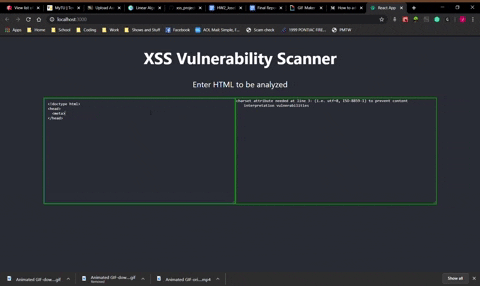

# XSS Vulnerability Analyzer
## Overview
This project was for a course teaching application software security. The project topic was *Cross-site scripting (XSS)*, a client-side variant of the injection attack, which attempts to trick a website into placing malicious code onto a visitor's browser. To demonstrate an understanding of XSS, contributors developed a web application that can analyze HTML code, detect XSS vulnerabilities, and report the problems.

Guidelines and examples provided by [OWASP](https://owasp.org/search/?searchString=xss) were used to aid the creation of the analyzer.

## Requirements
- Node.js, to install packages required by the Web App
- Python3, to install packages for the backend analyzer

### Installing The Project

1. To install the required Web App dependencies:  
   * Open a terminal.
   * CD into the xvs_frontend/ directory.
   * Enter the command *npm install*
2. To install the required back-end packages:   
   * Open a terminal.
   * CD into the xvs_backend/ directory.
   * (Recommended) Start or Create and Start a python virtual environment.
   * Install packages for your Operating system
      * pip3 install flask html.parser flask_cors re
3. To run: 
    Flask server:
    * In xvs_backend/ directory: 
      Enter command *py main.py* 
    React Web App:
    * In xvs_frontend/ directory: 
      Enter command *npm start*
      
## Test Code
Example source code to test can be found in *xvs_backend/test/*

## Helpful git commands
https://confluence.atlassian.com/bitbucketserver/basic-git-commands-776639767.html

## Test cases found at
https://github.com/josedlr93/xss_project/blob/master/xvs_backend/test/testCode.txt

## Additional demos

## Contributors
Jose De La Rosa  
Zach Krell
